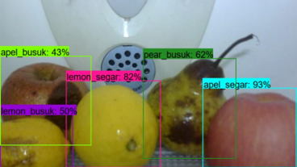
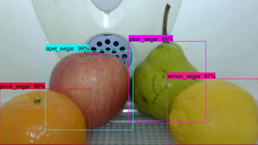
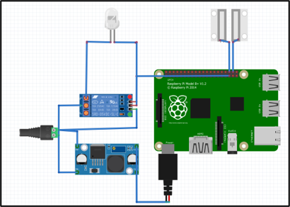

# Smart Fridge Food Detection

A Raspberry Pi pipeline that monitors food freshness (*fresh vs rotten*) using an EfficientDet Lite1 model, triggers automated lighting via a magnetic door sensor, and syncs real-time inventory to Firebase Realtime Database.





## System Workflow

1. **Door Trigger (GPIO 16):** Detects when the door opens and activates the internal fridge lamp via relay (GPIO 26).
2. **Capture & Inference:** Captures a frame with the USB camera, runs EfficientDet Lite1 object detection, and saves annotated results to `captured_images/`.
3. **Cloud Sync:** Aggregates item counts and pushes updated inventory states, timestamps, and reference keys to Firebase RTDB.
4. **Mobile App:** Mobile client reads the updated database in real-time to render fridge contents with matching item template graphics.

---

## Mobile Application

This edge pipeline is designed to work seamlessly with the frontend client:

* **Repository:** [Smart Fridge Mobile App](https://github.com/Alfa4258/food-monitoring-app.git)
* **What it does:** Displays real-time inventory counts, freshness status, and pre-configured item template images loaded directly from Firebase.

---
## Supported Food Classes

The custom EfficientDet Lite1 model is trained to recognize **25 food items** (fresh & rotten states):

`apel` • `ayam` • `bayam` • `brokoli` • `buncis` • `jagung` • `jamur` • `jeruk` • `kacangpanjang` • `kangkung` • `kentang` • `kubis` • `labusiam` • `lemon` • `naga` • `nanas` • `pear` • `sapi` • `sawihijau` • `sawiputih` • `tahu` • `tauge` • `tempe` • `terong` • `wortel`

## Hardware & Pin Mapping



- **Raspberry Pi 3** — main processing unit
- **USB Camera** — image capture
- **Magnetic Door Sensor (MC-38)** — GPIO 16 (BCM)
- **Relay Module** — GPIO 26 (BCM), for fridge lighting
- **LED Light** — internal fridge lighting

---

## Setup & Execution

1. **Clone & Install Dependencies**
   ```bash
   git clone https://github.com/Alfa4258/raspi-food-detection-efficientdet.git
   cd smart-fridge-food-monitoring

   python3 -m venv venv
   source venv/bin/activate
   pip install -r environment-raspi.txt

2. **Configure Firebase Credentials**
   * Copy the environment template:
     ```bash
     cp .env.example .env
     ```
   * Set your service account private key path and database URL in `.env`:
     ```env
     FIREBASE_KEY_PATH=secrets/firebase-adminsdk.json
     FIREBASE_DB_URL=[https://smart-fridge-fd12e-default-rtdb.asia-southeast1.firebasedatabase.app/](https://smart-fridge-fd12e-default-rtdb.asia-southeast1.firebasedatabase.app/)
     ```

3. **Run the Pipeline**
   ```bash
   python detect.py
   ```
   Press `Ctrl + C` to stop the loop and release camera and GPIO resources cleanly.